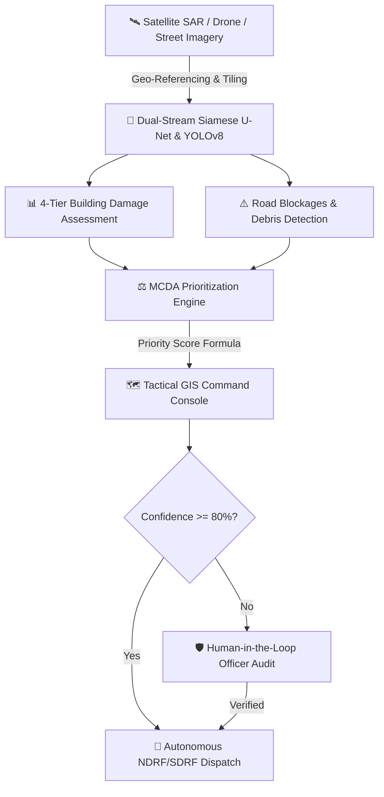

# 🛰️ ResQ-Vision AI — Tactical Disaster Mapping & Relief Prioritization Platform

[](https://sih.gov.in)
[](https://sih.gov.in)
[](https://github.com/jahanvipandey22)
[](https://sih.gov.in)

> **ResQ-Vision AI** is an AI-powered geospatial platform designed for first responders (NDRF, SDRF, DDMAs) that ingests satellite, drone, and crowdsourced street imagery to perform **Building Damage Assessment (BDA)**, **road hazard extraction**, and **mathematical multi-criteria relief triage** in under 20 minutes.

---

## 🌟 Key Capabilities & Live Prototype Features

1. 🗺️ **Tactical GIS Command Center:** Interactive Leaflet map displaying real-time damage tier polygons (No Damage, Minor, Major, Destroyed), road blockades, and critical assets (Hospitals, Relief Camps).
2. 🤖 **Dual-Stream Vision Pipeline:** Simulates Siamese Neural Network change detection (pre- vs post-disaster satellite tiles) & YOLOv8 structural debris segmentation.
3. ⚖️ **MCDA Relief Triage Algorithm:** Dynamic mathematical scoring factoring structural damage severity (40%), population vulnerability (35%), and road accessibility (25%).
4. 🚒 **Intelligent Rescue Routing:** Automatically calculates safe evacuation corridors while circumnavigating submerged bridges and high-voltage power hazards.
5. 🛡️ **Human-in-the-Loop (HITL) Verification:** Auditable verification interface for field commanders to inspect confidence heatmaps (<80% flags) before dispatching rescue convoys.
6. 📶 **Offline-First Resilient Architecture:** Designed to cache spatial tiles locally and synchronize over low-bandwidth 2G / LoRa mesh networks during total cellular blackout.

---

## 🏗️ System Architecture Workflow



---

## 🚀 How to Run the Prototype

### Option 1: 1-Click Launch (Windows)
Double click `run_prototype.bat` or execute in terminal:
```bash
./run_prototype.bat
```

### Option 2: Manual Start
```bash
# 1. Install dependencies
pip install -r requirements.txt

# 2. Run Flask server
python app.py
```
Open your web browser and navigate to: **`http://127.0.0.1:5000`**

---

## 📋 Judge Presentation Demo Flow (5-Step Live Pitch)

1. **Step 1 (Overview):** Show the live **Tactical Map (Puri-Bhubaneswar Flood Corridor)** with color-coded damage tiers and flooded roads.
2. **Step 2 (Queue & Ranking):** Point out the **Ranked Relief Triage Queue** on the left panel (Sector 4 at top priority).
3. **Step 3 (Live Weight Adjustment):** Click *"Adjust MCDA Triage Weights"*, move sliders live to show how the priority scores adapt dynamically.
4. **Step 4 (AI Vision Studio):** Click *"Drone Flood Feed"* or *"Cyclone Damage"* in the Vision Studio to run instant computer vision change detection.
5. **Step 5 (Dispatch & HITL Audit):** Click *"Dispatch Rescue Team"* or *"Verify"*, demonstrate how it commits an immutable entry into the **Human-in-the-Loop Audit Log**.

---

## 👤 Team Details
- **Team Name:** Girls Who Master
- **Problem Statement ID:** SOAIDEATHON-S34
- **Lead Developer:** Jahanvi Pandey
